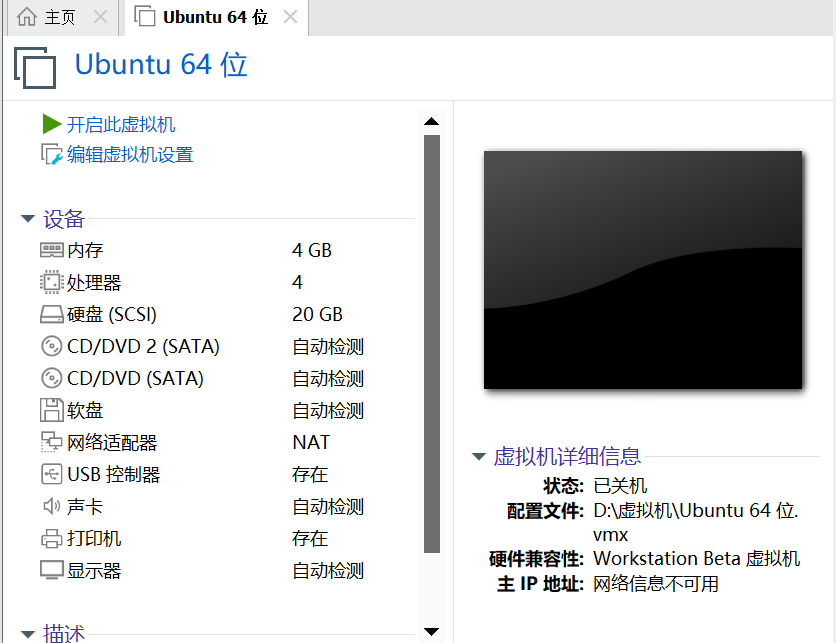

# Linux基础 --Ubuntu的使用学习

## Linux的发行版和内核版

1.内核是系统的心脏，是运行程序和管理磁盘和打印机等硬件设施的核心程序。

2.Linux的发行版就是Linux内核开发的用户端，发行版有很多种，而Linux内核只有一个，其中最受欢迎的发行版就是Ubuntu。

下载ISO安装[光盘映像文件](https://baike.baidu.com/item/光盘映像文件/9207188)之后，将其制作成启动盘，直接用安装光盘的方式进行安装，这是最简单，也是最常用的方法，推荐初学者使用。 [11] Ubuntu支持Live，可以直接体验系统

为便于学习和实验，在Windows平台下利用[虚拟机](https://baike.baidu.com/item/虚拟机/104440)安装Ubuntu是一个不错的选择，推荐使用Vmware Work station虚拟机软件。创建一台Ubuntu Linux虚拟机

## Ubuntu虚拟机的创建

创建之后就可以进入虚拟机了。

## Linux的文件目录结构

与Windows不同 在Linux中没有**盘符**的概念。只有一个根目录：**/**  

所有的文件都在它的下面。

基本的Linux发行版的基础 接下来我会学习基本的终端命令。
