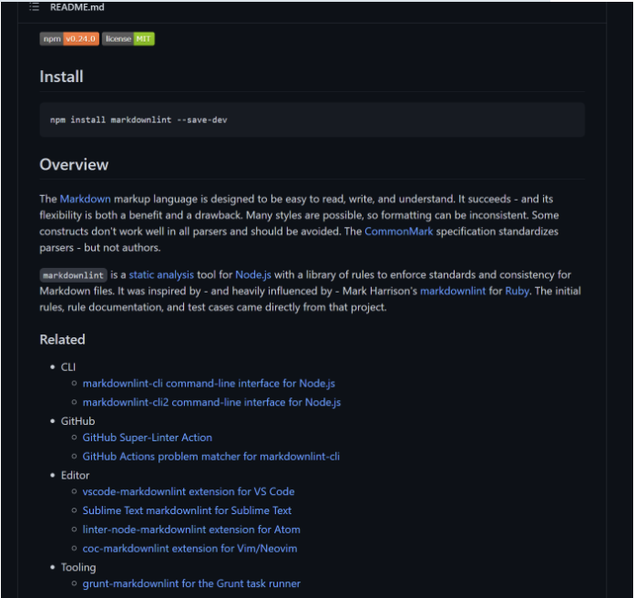

# 基于Markdown语法学习心得

[TOC]

------

*`Markdown`是一种**轻量级**标记语言，创始人是**约翰·格鲁伯**(John Gruber)。它允许人们 “使用易读易写的纯文本格式编写文档，然后转换成有效的 HTML 文档。*
*来自维基百科*

### 为什么要学习markdown？

起初，当学长们让我们使用markdown来当作写作语言的时候 我总在想这不是多此一举吗？难道txt格式不好吗？当我逐渐了解而且在使用GitHub的使用经历上来看，md有很多好处，换句话说md不仅也可以给任何文档排版，使之更加有结构，更加好看。同时markdown让我养成了一个良好的习惯：**记录的习惯**。

</img>

基于md的文档可以让访问者直观了解你想要输出的内容

</img>

本来我并不理解什么叫做轻量化语言， 当我用不同格式记录同一篇文章时效果来进行对比就知道Markdown到底有多么轻！

### Markdown 语法

在我个人看来markdown的语法相对而言是比较就简单的，使用Markdown不仅可以非常方便的记录笔记，而且可以直接导出对应的网站内容，导出可打印的文档。再加上Typora编辑器加成可以说在编辑文档方面并没有什么困难。因此在语法方面不再有详细的

### 学习心得

在接触Markdown语法后 我感觉相比较于word等编辑器来说更加的方便好用，我认为使用md会让我的表达更加的合理 也能更好的输出我的内容，同时我关注到 <u>Markdown画图</u>也是一个非常有趣的点，作为初学者我认为这个方面有非常大的探索空间，以后markdown学习方面我会持续关注该方向。

