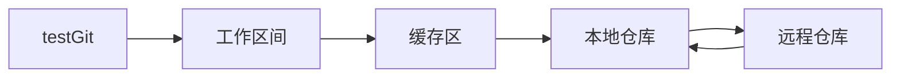

# 第二阶段学习笔记 基于GitHub的基础操作学习心得
目录
#  1.Git的历史
#  2.分布式控制系统
#  3.Git到底是怎么工作的
#  4.总结感悟

前言：**Git是一种分布式版本控制工具，学习一种工具的使用方法首先要搞清楚工具要解决的问题，怎么解决的，其次要多加实践，工具都是用会的。在这里 我不想记录我配置或者上传的本地仓库的一些步骤，毕竟如果不会这些，在我的GitHub也看不到这篇文章了🤣 Git作为强大的工具，单单学会Git 的 commit 和 push 的用法，并不能给我直观的反馈：git到底有什么用 难道就只是本地和远程仓库之间的一种交互吗？**

为此我展开我自己的探索。

## 1.Git的历史

Git是一款代码管理工具（Version Control System)，Git的创始人是“Linus Torvalds”

> ### Git 简史
>
> 同生活中的许多伟大事物一样，Git 诞生于一个极富纷争大举创新的年代。
>
> Linux 内核开源项目有着为数众多的参与者。 绝大多数的 Linux 内核维护工作都花在了提交补丁和保存归档的繁琐事务上（1991－2002年间）。 到 2002 年，整个项目组开始启用一个专有的分布式版本控制系统 BitKeeper 来管理和维护代码。
>
> 到了 2005 年，开发 BitKeeper 的商业公司同 Linux 内核开源社区的合作关系结束，他们收回了 Linux 内核社区免费使用 BitKeeper 的权力。 这就迫使 Linux 开源社区（特别是 Linux 的缔造者 Linus Torvalds）基于使用 BitKeeper 时的经验教训，开发出自己的版本系统。 他们对新的系统制订了若干目标：
>
> - 速度
> - 简单的设计
> - 对非线性开发模式的强力支持（允许成千上万个并行开发的分支）
> - 完全分布式
> - 有能力高效管理类似 Linux 内核一样的超大规模项目（速度和数据量）
>
> 自诞生于 2005 年以来，Git 日臻成熟完善，在高度易用的同时，仍然保留着初期设定的目标。 它的速度飞快，极其适合管理大项目，有着令人难以置信的非线性分支管理系统
>
> 

[Git - Git 简史 (git-scm.com)](https://git-scm.com/book/zh/v2/起步-Git-简史)

了解到git的发展历程之后，我发现可以有效、高速地处理从很小到非常大的项目版本管理。 [1] 也是[Linus Torvalds](https://baike.baidu.com/item/Linus Torvalds/9336769)为了帮助管理Linux内核开发而开发的一个开放源码的版本控制软件。（Linux系统我还没有使用过，之所以git通过命令行实现也是因为Git 是用于 [Linux内核](https://baike.baidu.com/item/Linux内核/10142820)开发的[版本控制](https://baike.baidu.com/item/版本控制)工具 都没有图像化界面的封装）

## 2.分布式控制系统

既然Git是**分布式版本控制系统**，我很想知道到底什么是分布式控制系统

> 分布式系统是若干独立计算机的集合，这计算机对用户来说就像单个相关系统。
>
> 以上定义摘自<<分布式系统原理与范型>>一书。

从进程角度看，两个程序分别运行在两个台主机的进程上，它们相互协作最终完成同一个服务（或者功能），那么理论上这两个程序所组成的系统，也可以称作是“分布式系统”。根据我的理解，分布式系统通俗的来讲说就是系统拆分为多个子系统，来共同协作完成一个工作。也就是说分布式系统一定是由多个节点组成的系统。其中，节点指的是计算机服务器，而且这些节点一般不是孤立的，而是互通的。

> **分布式环境的特点**
>
> 
>
> 1. 分布性：服务部署空间具有多样性
>
> 2. 并发性：程序运行过程中，并发性操作是很常见的。比如同一个分布式系统中的多个节点，同时访问一个共享资源。数据库、分布式存储
>
> 3. 无序性：进程之间的消息通信，会出现顺序不一致问题
>
>    [大白话告你什么是分布式，史上最全详解][大白话告你什么是分布式，史上最全详解！ - 知乎 (zhihu.com)](https://zhuanlan.zhihu.com/p/382966178)

## 3.Git到底是怎么工作的

在简单了解什么是分布式系统之后，我就开始想要了解git到底是怎样工作的。

在配置git的过程中也会基本来了解到git的一个特性：即使无法联网也能提交代码。

工作区间: 即我们创建的工程文件， 在编辑器可直观显示；

缓存区: 只能通过git GUI或git shell 窗口显示，提交代码、解决冲突的中转站；

本地仓库: 只能在git shell 窗口显示，连接本地代码跟远程代码的枢纽，不能联网时本地代码可先提交至该处；

远程仓库: 就是在GitHub创建的仓库

**那么我想了解的是代码是如何在这四个区间流动的呢？**

### 提交代码到远程仓库

其中本地仓库和远程仓库之间通过HTTP/ssh 来产生链接

> `git init ` 表示在当前的项目目录中生成本地的git管理；
>
> `git add README.md` 将“README.md”文件保存至缓存区，实际开发中一般使用 `git add -A`，使用-A:将新增、删除、修改的文件改动全保存至缓存区；
>
> `git commit -m "first commit"` 将代码从缓存区保存至本地仓库，实际开发中一般使用`git commit -am "说明的文字"`，使用 -a：如果没文件更改操作（增、删、改名）就可以省略git add指令；
>
> `git remote add origin https://github.com/wteam-xq/testGit.git`将本地仓库与指定的远程仓库创建 联系；
>
> `push -u origin master` 将本地仓库代码推送至远程仓库，实际开发中 该指令后需要输入github 账号以及密码。

[git记录数据的流程][(21条消息) Git工作原理_只会一点Java-CSDN博客](https://blog.csdn.net/u014297148/article/details/89406342?spm=1001.2101.3001.6650.17&utm_medium=distribute.pc_relevant.none-task-blog-2~default~CTRLIST~default-17.essearch_pc_relevant&depth_1-utm_source=distribute.pc_relevant.none-task-blog-2~default~CTRLIST~default-17.essearch_pc_relevant)

### .git又是怎样做到保存版本记录的呢？

在我思考这个我问题时 不仅对它感觉很好奇，如果每个版本都要保存 那么这么多人使用git 那么多版本迭代，难道它的这么的厉害吗？当我查找资料后 才窥见其中的一些原理

众所周知 在我们本地仓库中有一个.git文件夹 (**版本库：**工作区有一个隐藏目录 **.git**，这个不算工作区，而是 Git 的版本库。)

[Git 工作区、暂存区和版本库][Git 工作区、暂存区和版本库 | 菜鸟教程 (runoob.com)](https://www.runoob.com/git/git-workspace-index-repo.html)

- 图中左侧为工作区，右侧为版本库。在版本库中标记为 "index" 的区域是暂存区，标记为 "master" 的是 master 分支所代表的目录树。
- 当我们执行**git.add**时 暂存区的目录树被更新，同时工作区修改（或新增）的文件内容被写入到对象库中的一个新的对象中，而该对象的ID被记录在暂存区的文件索引中。

也就是说 刚开始文件上传到缓存区 而非直接进入远程仓库，在缓存区 git会记录你的每一次提交 git会把出现变更的文件直接拷贝，形成新的blob 这里涉及一个git的设计理念 **快照**git中的快照，就是一个备份，但这个备份不是像我们粘贴复制那么简单，git会处理，压缩，你可以使用这个快照恢复原来的状态。git会根据当前的内容生成一个校验和，是以此校验和为索引。每次提交，检测到校验和变化，就会生成一个新的快照，未更改的文件，则会链接到上一次的快照。这样就形成了一条链。

# 总结 感悟

通过对git原理的一些探究 我也明白一些git的基本原理  在这样的基础上 我对git的印象不再是仅仅是一种管理代码的工具，对其设计理念也产生一定的兴趣，花费一些时间去探究更深层次的内容 也会使更好的的去利用git 对底层原理的分析 也会是指引导我i自己去想一想出现的问题在那个地方，而不是去谷歌搜索后按照别人的步骤一步步走完.

这是没有意义的、另外由于精力和时间还有一些困惑没有解决。

1.如何理解git的快照概念？

2.怎么建立不同的版本测试？

3. 我想回溯和撤销已有的更改可以么？
4. 通过vscode直接上传git的操作
